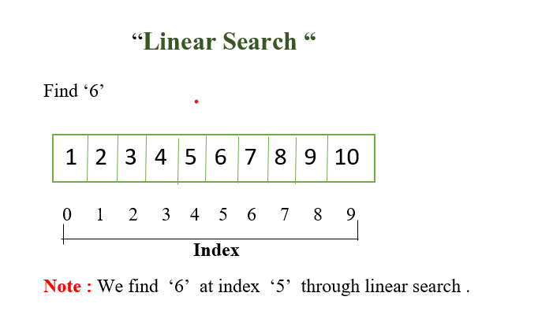

Linear Search is defined as a sequential search algorithm that starts at one end and goes through each element of a list until the desired element is found, otherwise the search continues till the end of the data set.

