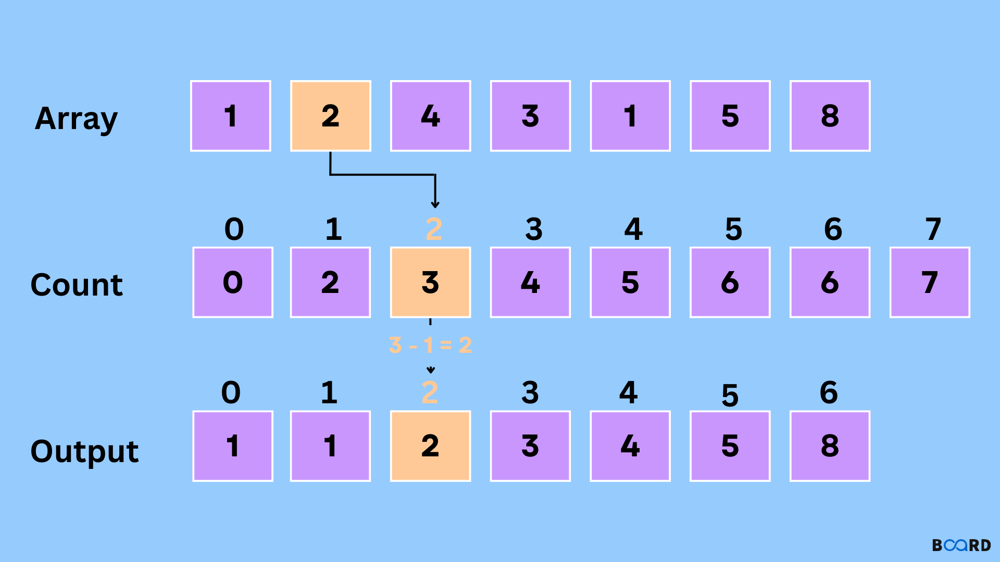
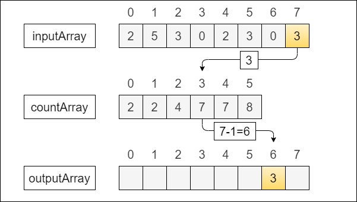

Counting sort is an integer sorting algorithm used in computer science to collect objects according to keys that are small positive integers. It works by determining the positions of each key value in the output sequence by counting the number of objects with

