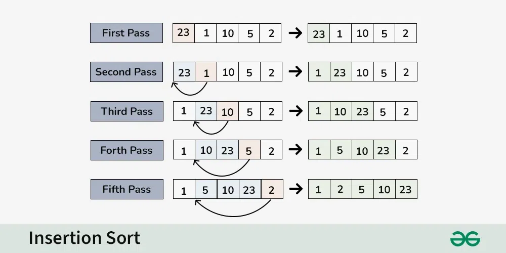

Insertion Sort – Data Structure and Algorithm Tutorials

Insertion sort is a simple sorting algorithm that works by iteratively inserting each element of an unsorted list into its correct position in a sorted portion of the list. It is a stable sorting algorithm, meaning that elements with equal values maintain their relative order in the sorted output.

Insertion sort is like sorting playing cards in your hands. You split the cards into two groups: the sorted cards and the unsorted cards. Then, you pick a card from the unsorted group and put it in the right place in the sorted group.

Insertion Sort Algorithm:
Insertion sort is a simple sorting algorithm that works by building a sorted array one element at a time. It is considered an “in-place” sorting algorithm, meaning it doesn’t require any additional memory space beyond the original array.

<a href="https://www.geeksforgeeks.org/insertion-sort/">read more here</a>

